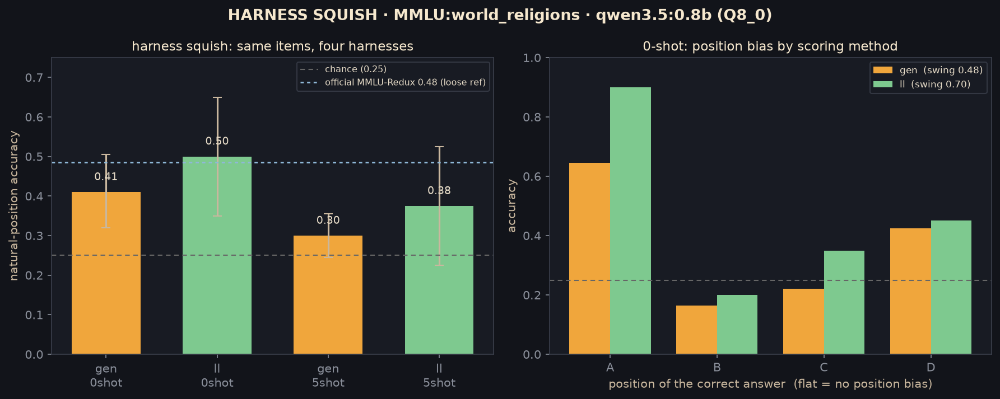
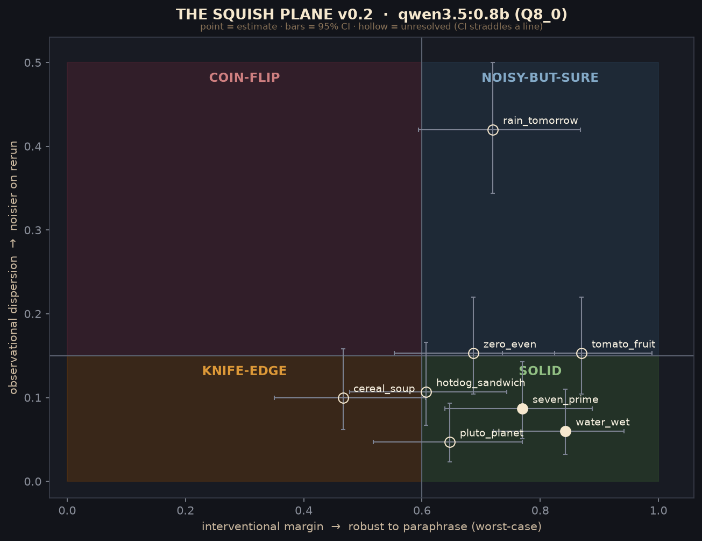

# SquishLab

**Measuring *squish*: how much a model's answer moves under things that shouldn't move it.**

A benchmark says a model scores 36%. Run the *same* items through a slightly different
eval harness and the same model scores 50%. Nothing about the model changed. The number
did. SquishLab is a small research toolkit for measuring that gap, and for reporting a
model's score the way it should be reported: **with error bars, and with a number for how
fragile the score itself is.**

> **Status: provisional / research-stage.** This is a working measurement harness plus a
> tested statistics library, not yet a packaged product. It runs today against a local
> model via [ollama](https://ollama.com). The findings below are real but were measured on
> a deliberately tiny model (`qwen3.5:0.8b`, 8-bit) to keep every variable controlled, they
> demonstrate the *method*; the [roadmap](#where-this-is-going) is pointing it at models
> people actually ship. The full decision-and-discovery record lives in
> [`docs/lab-journal.md`](docs/lab-journal.md).

---

## The idea in one paragraph

**Squish is sensitivity to things that shouldn't matter.** A reliable answer stays put when
you poke it in ways that carry no meaning; a squishy one slides around. There are exactly
two ways to poke it, and they turn out to be independent axes:

- **Observational** — ask the *same* question again (new random seed). How much does the
  answer disperse? This is sampling noise.
- **Interventional** — rephrase the question in a way that *preserves its meaning* (reword
  it, or shuffle the multiple-choice options). Does the answer shift? This is fragility.

Everything in SquishLab is one of those two pokes, measured with a confidence interval, at
one of two scopes: a **single prompt**, or a **whole benchmark**.

---

## Lens A — benchmark reliability

*Point squish at a benchmark and you stop trusting the single number.* Three things fall
out, each measured on the same 40-item MMLU slice, same model:

**1. The bare number is a mirage.** The model's "36%" on `world_religions` is a
position-bias artifact. Put the correct answer at slot A and it scores **65%**; put it at
slot B and it scores **17%** (below the 25% chance floor), because the model just *reaches
for "A"* 56% of the time. A leaderboard prints one number and hides a 48-point swing.

**2. Harness squish: a 20-point spread from the eval convention alone.** Hold the items
fixed and sweep two harness choices that don't change what the model knows, how you *score*
(sample a letter vs. read the log-probabilities) and how many *examples* you show it (0 vs.
5). Same model, same questions:



The same model is "30%" or "50%" depending on nothing but the harness. Log-probability
scoring reads ~8 points higher than sampling; few-shot examples *cost* ~12 points on a model
this small. Measured the official way, our crude local slice brackets the vendor's published
number, so the "gap" to the leaderboard was mostly *scoring method*, not capability.

**3. Config squish: the sampling settings move it too** (a little). Swapping our neutral
sampling config for the model author's recommended one barely touches a yes/no answer
(mean dispersion moved 0.001), but it clips the one nearly-unanimous prompt to fully
unanimous. The effect scales with how wide the output space is, negligible on a binary
choice, real on a benchmark's letter distribution.

And underneath all of it, the accuracy comes **with a bootstrap confidence interval over
items** (the correct unit, since re-runs of one question are correlated), which is wider and
more honest than the naive interval a leaderboard would compute over raw trials.

## Lens B — prompt reliability (the squish plane)

*Point the same idea at a single prompt and you can see reliability's shape.* Plot every
prompt by its two axes, observational dispersion (does it wobble on re-run?) against
interventional margin (does it survive a rephrase?), and four regions appear:



- **SOLID** — steady on re-run, steady under rephrase. Trustworthy.
- **NOISY-BUT-SURE** — wobbles on re-run but always lands the same way under rephrase.
- **KNIFE-EDGE** — *rock-solid on re-run, yet a meaning-preserving rephrase flips it.* This
  is the quadrant a re-run-only reliability check is blind to, and the reason the second
  axis exists. Our clearest example: "Is cereal a soup?" comes back a near-unanimous *no*
  every time, but "Is a bowl of cereal soup?" shifts it. Same question, different silhouette.
- **COIN-FLIP** — squishy on both axes.

The two axes collapse into a single **squish score** when you need one number, with one
subtlety we had to get right: re-run wobble is only a *defect* if there's a fact to be stable
about. A genuinely undecidable question ("will it rain tomorrow?") *should* wobble, that's
calibration, not squish. So the score gates the observational term behind a decidability
label and always counts the interventional term. (Appropriate uncertainty and epistemic
instability look identical from the outputs alone; only ground truth separates them.)

> A cross-lingual probe (`experiments/xlingual.py`) is the same machinery pointed sideways:
> the model is impressively consistent English-vs-Chinese on clear facts, *except* Pluto
> (95% "not a planet" in English, 62% in Chinese), exactly the fact with a recent,
> English-heavy, contested history.

---

## Why this matters

**A benchmark number without its squish is a claim without an error bar.** The entire
leaderboard genre reports point estimates for quantities that visibly move under choices
nobody standardizes. SquishLab reports the number *and* how much it slides, which is the
difference between "this model scores X" and "this model scores X, plus or minus the harness
you happened to use." If you are choosing a model on the strength of a leaderboard row, that
second half is the part you actually needed.

---

## What's actually here

```
src/squishlab/
  stats.py        Wilson / Newcombe / confident-shift / bootstrap CIs (tested)
  squish.py       the squish score + decidability gate + model-level headline
  client.py       explicit, portable ollama client (a documented sampling config, not defaults)
  benchmark.py    multiple-choice machinery: option-permutation, position placement
experiments/
  bench.py        Lens A: position-debiased accuracy + CI + reorder squish
  harness.py      Lens A: the gen-vs-loglik x 0-vs-5-shot harness sweep
  config_ab.py    Lens A: controlled vs author-recommended sampling config
  vpoc_real.py    Lens B: the squish plane (dispersion x margin, typed paraphrases)
  score.py        Lens B: the squish score, as a post-processing pass
  xlingual.py     the cross-lingual consistency probe
docs/lab-journal.md   every decision and finding, with the reasoning that produced it
```

### Run it

Needs Python 3.11+, [ollama](https://ollama.com) running locally, and a model pulled
(`ollama pull qwen3.5:0.8b`).

```bash
pip install -e ".[dev,bench]"     # library + test + dataset-loading deps

python experiments/harness.py     # the 20-point harness sweep (Lens A)
python experiments/vpoc_real.py   # the squish plane (Lens B)
pytest                            # the stats library tests its own statistics
```

The library primitives stand alone:

```python
from squishlab import wilson_ci, bootstrap_ci, squish_score

wilson_ci(36, 100)                                   # a proportion, with an honest interval
squish_score(dispersion=0.10, margin_max=0.47,       # cereal_soup: steady on re-run (low
             answer=None)                            # dispersion) but fragile to rephrase
                                                     # -> a knife-edge, flagged by the score
```

---

## Where this is going

> **TODO / roadmap** (provisional, in rough priority):
>
> - **A clean `compare(model_a, model_b, benchmark)` surface.** Today the value lives in
>   runnable experiments; the adoption-shaped version is one call that returns
>   accuracy±CI + squish for two models on a benchmark. Most of the parts exist.
> - **Real models, via a proper backend.** The client is already plain HTTP with a portable
>   config (by design), so swapping ollama for a vLLM / OpenAI-compatible endpoint is an
>   adapter, not a rewrite. The open question every finding here raises: does the story
>   survive contact with a 7B, a 70B, a frontier model?
> - **Coding evals.** A code-execution scorer + prompt-perturbation interventional axis,
>   to make Lens A relevant where agentic tools actually live.
> - **Config-A/B on the benchmark**, where the wider output tail should make config squish
>   bite the way it doesn't on binary prompts.
> - TruthfulQA MC1 (predict *higher* squish, adversarial by construction); more subjects;
>   the batch-invariance / kernel-nondeterminism probe (GPU-only).

---

## A note on how this was built

SquishLab keeps a lab journal, not because the code needs it but because a reliability tool's
credibility *is* its reproducibility. Every methodological fork, every finding, and every
prediction-made-before-the-run lives in [`docs/lab-journal.md`](docs/lab-journal.md), with
the wrong turns left in and marked rather than deleted. If you want to trust a number here,
that's where you check its receipts.

*MIT licensed. Built by Kate Louie.*
