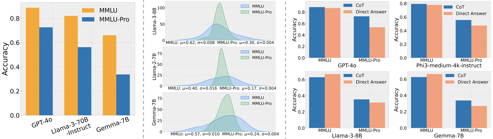

# Research notes: prior art and precedent

A running file of external work that measures, or brushes up against, the thing WobbleLab
measures: how much a benchmark number moves under choices that shouldn't move it. The point
is not a literature review for its own sake. It's ammunition. When someone hears "score
distributions instead of point estimates" and files it under fringe, the honest answer is
that the benchmark authors themselves already do a manual version of this, they just bury it
in an appendix and don't ship it as a tool. This doc collects those receipts.

Figures live in [`figures/`](figures/) next to this file. Decisions and findings from our own
runs live in [`../lab-journal.md`](../lab-journal.md); this doc is specifically for *other
people's* work and how it relates.

**Entry convention.** One section per source. Say what they measured, quote the concrete
numbers, then a "so what for WobbleLab" that names whether it's precedent (they did a version
of this), a harness fact (the canonical way the benchmark is actually run), or a contrast
(they stopped where we keep going).

---

## MMLU-Pro (Wang et al., 2024) — score *distributions* across prompt styles

Repo: [TIGER-AI-Lab/MMLU-Pro](https://github.com/TIGER-AI-Lab/MMLU-Pro) · Paper: *MMLU-Pro: A
More Robust and Challenging Multi-Task Language Understanding Benchmark* (NeurIPS 2024).

The find that started this doc. In their robustness section the authors run each model under
**24 different prompt styles** and, instead of reporting one accuracy, they plot the *whole
distribution* of accuracy across those styles, with a mean and a standard deviation.

Three panels: (left) MMLU-Pro is harder than MMLU, the standard sell. (middle) the one that
matters, the accuracy distribution across 24 prompt wordings, MMLU (blue, wide) vs MMLU-Pro
(green, narrow). (right) chain-of-thought vs direct-answer, per model.

Middle-panel numbers, read off the figure (accuracy μ, σ across the 24 styles):

| Model | MMLU (μ, σ) | MMLU-Pro (μ, σ) |
|---|---|---|
| Llama-3-8B | 0.62, 0.008 | 0.30, 0.004 |
| Llama-2-7B | 0.40, 0.016 | 0.17, 0.004 |
| Gemma-7B | 0.57, 0.010 | 0.24, 0.004 |

The green distributions are 2 to 4 times narrower than the blue: **MMLU-Pro is deliberately
less sensitive to prompt wording**, and they prove it by showing σ shrink toward a flat 0.004.
That σ is exactly WobbleLab's interventional axis, a meaning-preserving prompt change fed in,
the resulting movement in the score measured. The benchmark's own authors ran it.

Right panel, CoT vs direct answer: on MMLU-Pro, chain-of-thought beats direct answer by a lot
(GPT-4o ~0.72 vs ~0.53, a 19-point gap), while on plain MMLU they're tied or direct even wins
slightly (Llama-3-8B: CoT 0.62 vs direct 0.66). Confirms that CoT is a high-leverage harness
knob *specifically on MMLU-Pro*, which is why the official harness mandates it (see below).

**So what for WobbleLab — precedent, and a refinement.**

1. **Precedent.** Point-estimate skeptics get a real citation: a top benchmark reports score
   *distributions* with μ and σ under prompt perturbation. WobbleLab's contribution is to make
   that a standing instrument (any model, any benchmark, per-item CIs, the observational axis
   they didn't measure, plus a combined score) instead of a one-off appendix study on 3 models.

2. **The wobble hierarchy (this is the sharp bit).** Not all harness knobs move the number
   equally, and this figure plus our own F-021 proves it:
   - Prompt *wording* (their 24 styles): σ ≈ **0.4 to 1.6 points**. Small. MMLU-Pro shrinks it further.
   - Scoring method / shot count / CoT-vs-direct (their right panel; our F-021 gen-vs-ll ×
     0-vs-5-shot): **6 to 20 points**.

   Same benchmark, two classes of harness choice, an order of magnitude apart. Our 20-point
   MMLU swing never contradicted their "prompt-robust" claim, we were turning higher-leverage
   knobs (how you score, whether you reason) than their wording study varied. A credible
   reliability report has to say *which* knob it moved, because "wobble" without that is
   ambiguous by a factor of ten.

**Harness facts (the official MMLU-Pro protocol, for when we reproduce it).** 5-shot CoT
(`--ntrain 5`, per-category few-shot examples with hand-written reasoning), temperature 0,
`max_new_tokens 2048`, stop on `"Question:"`. System prompt verbatim:

> The following are multiple choice questions (with answers) about {$}. Think step by step and
> then finish your answer with "the answer is (X)" where X is the correct letter choice.

Answer extraction is a 3-tier regex cascade: `answer is \(?([A-J])\)?` → `.*[aA]nswer:\s*([A-J])`
→ last standalone `[A-J]`. Note temperature 0 means the *official* number has **zero**
observational (run-to-run) wobble by construction; the wobble that lives in it is entirely
interventional. Sampling variance only appears if you deviate from their temp.

---

## GPQA (Rein et al., 2023) — the canonical free-generation harness

Repo: [idavidrein/gpqa](https://github.com/idavidrein/gpqa) · Paper: *GPQA: A Graduate-Level
Google-Proof Q&A Benchmark*. Gated dataset (`Idavidrein/gpqa`), 198-item Diamond subset.

Not a distribution study like MMLU-Pro, but the reason it's here is the **harness fact**: GPQA
is scored as free generation, not a constrained letter. The official zero-shot prompt formats
choices as `(A) ... (B) ...` and instructs:

> Format your response as follows: "The correct answer is (insert answer here)"

Extraction is a regex cascade on the parenthesized answer (`answer is \((.)\)`, with fallbacks
down to any `\((.)\)`). Choices are shuffled with a seeded `random.shuffle`, tracking the
correct index, which is what our loader reproduces.

**So what for WobbleLab.** GPQA is scored as free generation ending in "The correct answer is
(X)", not a constrained single letter. That is the *canonical operating point* the benchmark's
number lives at, and it is what our anchor must reproduce. A benchmark's canonical harness
(prompt format, extraction, shots, CoT, budget) is part of the benchmark, and the tool measures
the anchor there first, then reports the movement under each knob as a deviation from it. This is
the argument for `Benchmark` owning its canonical harness, not just its data
([docs/design/architecture.md](../design/architecture.md)).

---

## Centralized eval harnesses: lm-evaluation-harness and HELM

Repos: [EleutherAI/lm-evaluation-harness](https://github.com/EleutherAI/lm-evaluation-harness) ·
[Stanford CRFM HELM](https://github.com/stanford-crfm/helm).

The canonical-harness batteries already exist, which is why WobbleLab should **wrap, not rebuild**.

- **lm-eval-harness** — the de facto standard, what the Open LLM Leaderboard runs. Tasks are
  declarative YAML with Jinja2 templates; it ships GPQA (`leaderboard_gpqa`, **0-shot**) and
  MMLU-Pro (`leaderboard_mmlu_pro`, **5-shot, CoT**) with prompts / few-shot / extraction
  programmed in. Note this makes "canonical" plural even inside one framework: lm-eval's GPQA is
  a 0-shot multiple-choice readout, **not** the authors' free-generation "(X)" CoT harness, and
  its MMLU-Pro is 5-shot CoT-gen. So lm-eval's number, the authors' number, and a provider's
  number are three different harnesses.
- **HELM** — holistic eval that **already runs input-perturbation robustness**: a collection of
  perturbations (typos for robustness, dialect for fairness), scored as **worst-case accuracy**
  before vs after. This directly bounds WobbleLab's niche: input perturbation is taken. Our gap
  is elsewhere — **harness-choice** wobble (scoring / shots / CoT / budget across *named real*
  harnesses), the **systems / nondeterminism** axis, **honest CIs** that dissolve close
  comparisons, and the **reliability-card** framing. HELM reports worst-case drop, not a
  per-comparison "is this gap real."

**So what for WobbleLab.** Wrap lm-eval-harness (or lighteval / Inspect) as the anchor provider;
the differentiation is the reporting and the two-lens split, not the eval plumbing. Read HELM's
perturbation module in detail before finalizing the niche.

## The "one model, many numbers" divergence (the harness-wobble evidence)

The strongest real-world evidence that harness choice moves the number, from HuggingFace's own
[Open LLM Leaderboard MMLU writeup](https://huggingface.co/blog/open-llm-leaderboard-mmlu):

> **LLaMA 65B on MMLU: 0.637 (Original) · 0.637 (HELM) · 0.488 (Eleuther Harness, Jan 2023)** —
> a **~15-point** swing on the *same model and benchmark*, purely from implementation.

Causes: prompt formatting (the Harness dropped the topic line and added a "Choices:" prefix),
and answer extraction (Original compared single-letter probabilities; HELM generated text and
matched a letter; the Harness scored full-answer-sequence log-likelihood including explanation
text). Combined with the documented **MMLU-Pro saturation** (frontier models cluster in the
88-94% band, rank order "increasingly noise-driven"), this is the empirical spine of the
benchmark lens: the sharpest product is not perturbations we invent, it is **quantifying the
spread across the harnesses people already use, and reporting which model comparisons survive
it.** See [../design/strategy.md](../design/strategy.md).

## Threads to chase (backlog for this doc)

- The original **MMLU** position-bias / "always-C" literature (Zheng et al., *Large Language
  Models Are Not Robust Multiple Choice Selectors*), the academic precedent for position-swing.
- **HELM's perturbation module** in code-level detail: exactly which perturbations, how worst-case
  is computed, whether any CI is reported. Determines the precise niche boundary.
- Whether anyone ships a **per-model reliability card** with honest CIs + fragility, and what is
  missing from it (the reporting-side gap).
